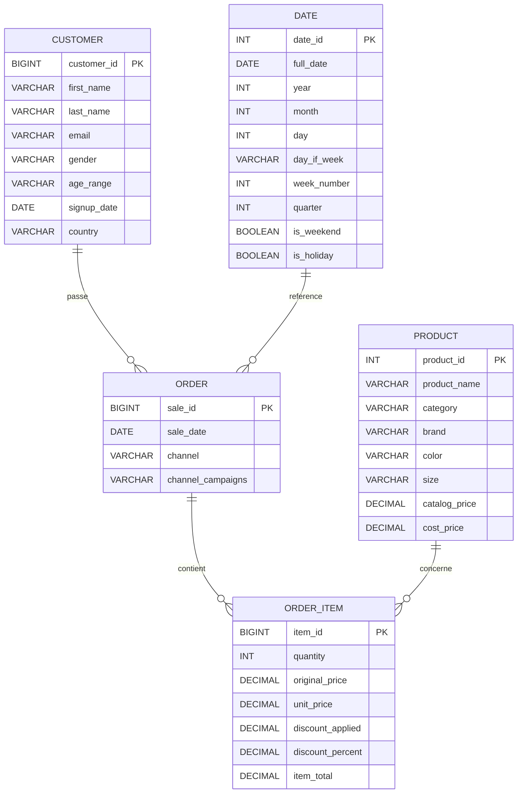

# 📘 Modélisation des données – Normalisation en 3FN

## 1. Contexte du projet

Ce projet s’inscrit dans la mise en place d’un **pipeline ETL analytique** visant à transformer des données de ventes brutes en un **modèle relationnel normalisé**, exploitable pour l’analyse décisionnelle.

Les données sources sont fournies sous forme de fichier plat (CSV / Excel) et contiennent des informations relatives aux clients, produits, commandes et ventes.

L’objectif de ce document est de :

* décrire **la démarche de modélisation**,
* justifier la **normalisation jusqu’à la troisième forme normale (3FN)**,
* présenter un **schéma Entité–Association (EA)** interprétable.

---

## 2. Analyse de la structure initiale

L’analyse exploratoire (voir notebook EDA) met en évidence que :

* chaque ligne représente une **vente élémentaire** (ligne de commande),
* les informations client et produit sont **répétées sur plusieurs lignes**,
* certaines colonnes sont **calculées** (totaux, remises),
* les données ne respectent pas les principes de normalisation.

👉 Les données sources sont donc **non normalisées**.

---

## 3. Identification des entités métier

À partir de l’analyse métier et fonctionnelle, les entités suivantes ont été identifiées :

* **Client** : informations relatives aux acheteurs
* **Produit** : catalogue des produits vendus
* **Commande** : transaction globale effectuée par un client
* **Ligne de commande (Vente)** : détail des produits vendus dans une commande
* **Date** : dimension temporelle pour l’analyse

Ces entités constituent la base de la modélisation relationnelle.

---

## 4. Démarche de normalisation

### 4.1 Première forme normale (1FN)

Principes :

* attributs atomiques
* absence de groupes répétitifs

**Application :**

* chaque cellule contient une valeur unique
* les ventes sont représentées ligne par ligne

✅ La 1FN est respectée après séparation logique des entités.

---

### 4.2 Deuxième forme normale (2FN)

Principes :

* être en 1FN
* absence de dépendances partielles vis-à-vis d’une clé composée

**Problème initial :**

* les informations client et produit dépendent partiellement de la vente

**Solution :**

* séparation en tables distinctes : `customers`, `products`
* la table `order_items` ne contient que les attributs dépendant entièrement de la vente

✅ La 2FN est respectée.

---

### 4.3 Troisième forme normale (3FN)

Principes :

* être en 2FN
* absence de dépendances transitives

**Problème initial :**

* informations non directement liées à la clé primaire stockées ensemble

**Solution :**

* les entités sont isolées selon leur dépendance fonctionnelle
* chaque attribut dépend **uniquement de la clé primaire** de sa table

✅ Le modèle final respecte la 3FN.

---

## 5. Modèle relationnel final

### 5.1 Tables et clés primaires

* **customers** (`customer_id`)
* **products** (`product_id`)
* **orders** (`sale_id`)
* **order_items** (`item_id`)
* **dim_dates** (`date_id`)

### 5.2 Clés étrangères

* `orders.customer_id` → `customers.customer_id`
* `order_items.sale_id` → `orders.sale_id`
* `order_items.product_id` → `products.product_id`
* `orders.sale_date` → `dim_dates.full_date`

---

## 6. Schéma Entité–Association (EA)

Le schéma ci-dessous représente les entités, leurs attributs clés et les relations entre elles.

---

## 7. Conclusion

La modélisation proposée :

* élimine les redondances
* garantit l’intégrité des données
* respecte strictement la **troisième forme normale (3FN)**
* est adaptée à un **usage analytique et décisionnel**

Ce modèle constitue la base du chargement des données dans la base PostgreSQL dans le cadre du pipeline ETL.
